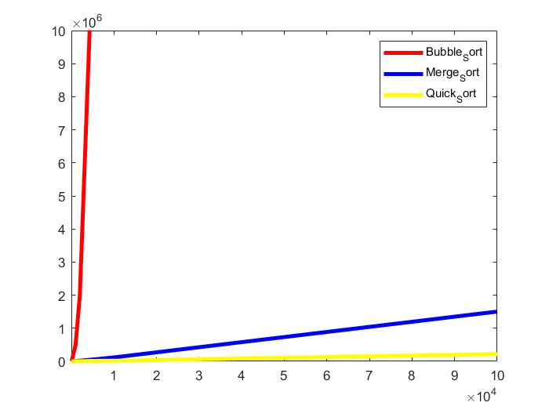

# 实验一、分治算法实验报告

## 学号：20201060434

## 实验目的

通过排序算法的程序实现和执行时间测试，与理论上的结论进行对比分析，深入理解算法时间复杂度渐进性态和增长率的概念；理解分治算法设计的基本思想、递归程序实现的基本方法，加深对分治算法设计与分析思想的理解。

## 实验原理

+ 算法时间复杂度分析的相关概念

&nbsp;&nbsp;&nbsp;&nbsp;算法的计算时间取决于算法中某些操作的执行次数，这些操作是算法时间复杂度分析的依据。增长率反映了算法的计算时间复杂度，即随着算法输入规模的增加、算法计算时间增加的趋势、算法的计算时间增加的趋势。算法的计算时间复杂度针对输入数据的等价类来分析或测试。

+ 随机数生成算法

&nbsp;&nbsp;&nbsp;&nbsp;通过程序生成（伪）随机数，作为实验用测试数据。可使用编程语言自带的random函数生成，也可以采用一些有效的随机数生成算法生成，例如：“线性同余法”，基于该算法，只要参数选择合适，所产生的伪随机数就能满足均匀性和独立性，与真正的随机数具有相近的性质。该算法的基本思想如下：

&nbsp;&nbsp;&nbsp;&nbsp;通过设置$x_{i+1}=(ax_i+c)\mod{m}$,n>=0,其中的4个整数参数：m——模数,m>0;a——乘数，0 <= a < m;c——增量，0 <= c < m;X0——开始值，0<= X0 < m。这样得到所求的随机数序列{Xi},称作线性同余序列。

+ 分治算法
&nbsp;&nbsp;&nbsp;&nbsp;分治算法的基本思想是将一个规模为n的问题分解为k个规模较小的子问题，这些子问题相互独立且与原问题性质相同。求出子问题的解，就可得到原问题的解。分治算法设计的一般步骤包括：
&nbsp;&nbsp;&nbsp;&nbsp;（1）分解，将要解决的问题划分成若干规模较小的同类问题；
&nbsp;&nbsp;&nbsp;&nbsp;（2）求解，当子问题划分得足够小时，用较简单的方法解决；
&nbsp;&nbsp;&nbsp;&nbsp;（3）合并，按原问题的要求，将子问题的解逐层合并构成原问题的解。

&nbsp;&nbsp;&nbsp;&nbsp;分治法的基本设计范式如下：

DivideAndConquer(data,n,solution)
&nbsp;&nbsp;if(n<=SizeLimit>) then

&nbsp;&nbsp;&nbsp;&nbsp;DirecSolution(data,n,solution)

&nbsp;&nbsp;else

&nbsp;&nbsp;&nbsp;&nbsp;DivideInput(data,n,smallerSets,smallerSizes,numberSmaller)

&nbsp;&nbsp;&nbsp;&nbsp;for i = 1 to numberSmaller do

&nbsp;&nbsp;&nbsp;&nbsp;&nbsp;&nbsp;DivideAndConquer(smallerSets[i],smallerSizes[i],smallerSolution[i])

&nbsp;&nbsp;&nbsp;&nbsp;end for

&nbsp;&nbsp;&nbsp;&nbsp;CombineSolutions(smallerSolution,numberSmaller,solution)

&nbsp;&nbsp;end if

+ 测试算法

&nbsp;&nbsp;&nbsp;&nbsp;以冒泡排序、合并排序和快速排序算法为例，这三个算法如下：

&nbsp;&nbsp;（1）BubbleSort(list,n)

&nbsp;&nbsp;numberOfPairs=n

&nbsp;&nbsp;swappedElements=true

&nbsp;&nbsp;while swappedElements do

&nbsp;&nbsp;&nbsp;&nbsp;numberOfPairs=numberOfPairs-1

&nbsp;&nbsp;&nbsp;&nbsp;swappedElements=false

&nbsp;&nbsp;&nbsp;&nbsp;for i=1 to numberOfPairs do

&nbsp;&nbsp;&nbsp;&nbsp;&nbsp;&nbsp;if list[i]>list[i+1] then

&nbsp;&nbsp;&nbsp;&nbsp;&nbsp;&nbsp;&nbsp;&nbsp;swap(list[i],list[i+1])

&nbsp;&nbsp;&nbsp;&nbsp;&nbsp;&nbsp;&nbsp;&nbsp;swappedElements=true

&nbsp;&nbsp;&nbsp;&nbsp;&nbsp;&nbsp;end if

&nbsp;&nbsp;&nbsp;&nbsp;end for

&nbsp;&nbsp;(2)MergeDort(list,first,last)

&nbsp;&nbsp;if first < last then

&nbsp;&nbsp;&nbsp;&nbsp;middle=(first+last)/2

&nbsp;&nbsp;&nbsp;&nbsp;MergeSort(list, first, middle)

&nbsp;&nbsp;&nbsp;&nbsp;MergeSort(list, middle+1, last)

&nbsp;&nbsp;&nbsp;&nbsp;MergeLists(list, first, middle, middle+1, last)

&nbsp;&nbsp;end if

&nbsp;&nbsp;MergeLists(list, start1, end1, start2, end2)

&nbsp;&nbsp;while (start1≤end1) and (start2≤end2) do

&nbsp;&nbsp;&nbsp;&nbsp;if list[start1] < list[start2] then

&nbsp;&nbsp;&nbsp;&nbsp;&nbsp;&nbsp;result[indexC]=list[start1]

&nbsp;&nbsp;&nbsp;&nbsp;&nbsp;&nbsp;start1=start1+1

&nbsp;&nbsp;&nbsp;&nbsp;else

&nbsp;&nbsp;&nbsp;&nbsp;&nbsp;&nbsp;result[indexC]=list[start2]

&nbsp;&nbsp;&nbsp;&nbsp;&nbsp;&nbsp;start2=start2+1

&nbsp;&nbsp;&nbsp;&nbsp;end if

&nbsp;&nbsp;indexC=indexC+1

&nbsp;end while

&nbsp;if start1≤end1 then

&nbsp;&nbsp;for i=start1 to end1 do

&nbsp;&nbsp;&nbsp;&nbsp;result[indexC]=list[i]

&nbsp;&nbsp;&nbsp;&nbsp;indexC=indexC+1

&nbsp;&nbsp;end for

&nbsp;else

&nbsp;&nbsp;for i=start2 to end2 do

&nbsp;&nbsp;&nbsp;&nbsp;result[indexC]=list[i]

&nbsp;&nbsp;&nbsp;&nbsp;indexC=indexC+1

&nbsp;&nbsp;end for

&nbsp;&nbsp;indexC=1

&nbsp;&nbsp;for i=finalStart to finalEnd do

&nbsp;&nbsp;&nbsp;&nbsp;list[i]=result[indexC]

&nbsp;&nbsp;&nbsp;&nbsp;indexC=indexC+1

&nbsp;&nbsp;end for

&nbsp;&nbsp;(3)QuickSort(list,first,last)

&nbsp;&nbsp;if first < last then

&nbsp;&nbsp;&nbsp;pivot=PivotList(list, first, last)

&nbsp;&nbsp;&nbsp;QuickSort(list, first, pivot-1)

&nbsp;&nbsp;&nbsp;QuickSort(list, pivot+1, last)

&nbsp;&nbsp;end if

&nbsp;&nbsp;PivotList (list, first, last)

&nbsp;&nbsp;PivotValue=list[first]

&nbsp;&nbsp;PivotPoint=first

&nbsp;&nbsp;for index=first+1 to last do

&nbsp;&nbsp;&nbsp;if list[index] < PivotValue then

&nbsp;&nbsp;&nbsp;PivotPoint=PivotPoint+1

&nbsp;&nbsp;&nbsp;Swap(list[PivotPoint],list[index])

&nbsp;&nbsp;end if

&nbsp;&nbsp;end for

&nbsp;&nbsp;Swap(list[first],list[PivotPoint]

&nbsp;&nbsp;return PivotPoint

## 实验输入数据集

+ 测试数据集：
  
&nbsp;&nbsp;通过手动设置随机数生成的个数参数n，利用线性同余法实现随机数的生成，生成的随机数用一维数组存储，作为排序的测试用数据。

+ 线性同余法生成随机数：

&nbsp;&nbsp;线性同余法中各参数设置如下：X0 = 3; a = 5; c = 1; m = 17。

## 实验内容

&nbsp;&nbsp;&nbsp;&nbsp;以冒泡排序、合并排序和快速排序算法为例，以生成的随机数作为实验中使用的测试数据。对每个算法，记录程序执行中随着测试数据增加算法基本操作执行次数，分析并以图形方式展现增长率；对以上三个排序算法，对比随着测试数据增加算法增长率变化趋势；测试、验证、对比算法时间复杂度的理论结论。

## 实验预期结果与实际结果

+ 实验预期结果：

实验过程及实验结果（C版）

```bash
gitpod /workspace/homework_template (main) $ gcc QuickSort.c -o quicksort
gitpod /workspace/homework_template (main) $ ./quicksort 
10
9       7       4       2       1       1
11
gitpod /workspace/homework_template (main) $ gcc MergeSort.c -o mergesort
gitpod /workspace/homework_template (main) $ ./mergesort
10
1       2       1       4       1       2       1       4       9
23
gitpod /workspace/homework_template (main) $ gcc BubbleSort.c -o bubblesort
gitpod /workspace/homework_template (main) $ ./bubblesort 
10
42
```

+ （2）、使用随机数生成方法生成包含100个随机数的测试数据，记录这些数据，并分别记录以上三个排序算法比较操作的执行次数；再重新生成包含100个随机数的测试数据，记录这些数据三个排序算法比较操作的执行次数。

|  | 第一次 | 第二次 |
| :---: |:---: | :---: |
|  BubbleSort  | 4884 | 4760 |
| MergeSort | 540 | 535 |
| QuickSort | 253 | 262 |

&nbsp;&nbsp;说明在当前算法来实现归并排序、快速排序、冒泡排序，其时间复杂度均与所输入的数据集有关，不同的数据集其对应基本操作的次数也存在不同。但是该处的冒泡排序是进行改进后的排序算法，增加一个标志变量flag，用于判断本趟排序过程中是否存在元素的交换，若已经排序完毕则后续的操作将不再执行，减少不必要的基本操作次数。

+ （3）、使用随机数生成方法生成不同规模的测试数据（10个，100个，1000个，2000个，5000个，10000个，100000个...）分别记录 BubbleSort、MergeSort 和 QuickSort 算法执行中比较操作的执行次数，以上三个算法比较操作次数增加的对比曲线图（折线）如下所示。

| | n = 10 | n = 100 | n = 1000 | n = 2000 |n = 5000 | n = 100000 |
| :---: | :---: | :---: | :---: | :---: | :---: | :---: |
| BubbleSort | 42 | 4884 | 496944 | 199099 | 12445819 | 49798749 |
| MergeSort | 23 | 540 | 8571 | 19086 | 54290 | 118280 |
| QucikSort | 11 | 253 | 2736 | 3857 | 12163 | 17484|



&nbsp;&nbsp;对于一个人算法时间复杂度分析而言，只要当问题规模达到一定规模后才可以很好的去判断一个算法的时间复杂度。因为当问题求解规模较小时，任何算法的时间复杂度均不存在较大的差异，只有当问题规模达到一定程度时，尤其是在较大规模的情况下，不同算法时间复杂度的差异将比较明显，同时也就涉及如何选择算法能够以较低时间复杂度来求解。

+ （4）、在 MergeSort 和 QuickSort 算法中设置比较操作执行的全局计数器，编程实现算法（输出最终的计数值）；设置记录每次递归调用时描述问题规模的变量，程序结束时输出其值；通过测试保证程序正确无误，注意递归程序的实现、调试
和测试。使用（3）中生成的测试数据（10 个，100 个，1000 个，2000 个，5000个，10000 个，100000 个，……），对于每种规模的测试数据，分别记录以上两个算法执行中各子问题的规模，并用表格方式记录所有情形各子问题的规模值。

| 排序算法 | 问题规模 | 各子问题规模 |
| :---: | :---: | :---: |
| MergeSort | n = 10 | 1       2       1       4       1       2       1       4       9|
|QuickSort | n = 10 | 9       7       4       2       1       1|
|MergeSort | n = 100 | 1       1       3       1       2     6       1       2       1       2 5       12      1       2       1       2       5       1       2       1 2       5       11      24      1       1       3       1       2       6 1       2       1       2       5       12      1       2       1       2 5       1       2       1       2       5       11      24      49      1 1       3       1       2       6       1       2       1       2       5 12      1       2       1       2       5       1       2       1       2 5       11      24      1       1       3       1       2       6       1 2       1       2       5       12      1       2       1       2       5 1       2       1       2       5       11      24      49      99 |
| QuickSort | n = 100 | 99      17      5       4       3       2       1       10      4       3 2       1       4       3       2       1       80      66      53      52 22      10      4       3       2       1       4       3       2       1 10      4       3       2       1       4       3       2       1       28 27      21      20      14      8       2       1       4     3       2 1       4       3       2       1       4       3       2       1       4 3       2       1       11      5       4       3       2       1       4 3       2       1       12      11      10      3       2       1       5 4       3       2       1 |

&nbsp;&nbsp;由于后续问题规模较大，递归求解子问题次数多，在此仅仅主要列出问题规模分别为： n = 10 与 n = 100,情况下程序递归调用求解子问题各子问题规模大小。通过上表可以明显得知对于MergeSort(归并排序)，属于先划分当问题规模到一定范围后可直接进行求解，然后对求解获得的子问题进行合并，最终获得问题的最终答案。

&nbsp;&nbsp;对于QuickSort（快速排序），属于没有划分过程的分治算法，而是通过每一趟排序，选定一个基准元素然后找到该基准元素所在的最终位置放入，此时以基准元素为界，将待排序数组划分为两个部分，且两部分规模至少比原待排序序列规模少1，因此在每一次划分待排序数列的规模都将减少，因此初始时刻子问题的规模是最大的。
