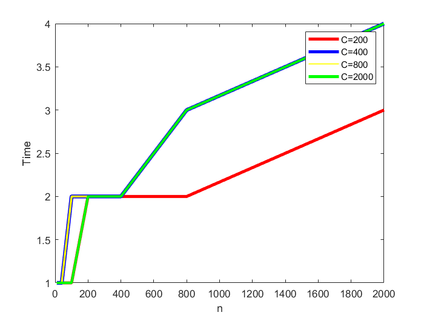

# 实验三贪心算法实验报告

## 学号：20201060434

## 实验目的

&nbsp;&nbsp;&nbsp;&nbsp;编程实现经典的贪心算法，理解贪心算法设计的基本思想、程序实现的相关技巧，加深对贪心算法设计与分析思想的理解。通过程序的执行时间测试结果，与理论上的时间复杂度结论进行对比、分析和验证。

## 实验原理

+ 贪心算法的基本思想
  
&nbsp;&nbsp;&nbsp;&nbsp;贪心算法求解优化问题的基本思想是：采用逐步构造最优解的方法。在每个
阶段，都作出一个当前最优的决策（在一定的标准下）。决策一旦作出，就不可再更改（作出贪心决策的依据称为贪心准则）。贪心算法的一般步骤如下：

&nbsp;&nbsp;&nbsp;&nbsp;(1) 根据拟解决问题选取一种贪心准则；

&nbsp;&nbsp;&nbsp;&nbsp;(2) 按贪心准侧标准对 n 个候选输入排序（以这一方法为代表，仍可基于堆来存储候选）；

&nbsp;&nbsp;&nbsp;&nbsp;(3) 依次选择输入量加入部分解中：如果当前这个输入量的加入，不满足约
束条件，则不把此输入加到这部分解中。

&nbsp;&nbsp;&nbsp;&nbsp;贪心算法的基本设计范式如下：

&nbsp;&nbsp;Greedy(A,n)

&nbsp;&nbsp;A: include n inputs

&nbsp;&nbsp;Solution=Ф

&nbsp;&nbsp;for i=1 to n do

&nbsp;&nbsp;&nbsp;&nbsp;x=Select(A)

&nbsp;&nbsp;&nbsp;&nbsp;if Feasible(solution,x) then

&nbsp;&nbsp;solution=Union(solution,x)

&nbsp;&nbsp;end if

&nbsp;&nbsp;end for

&nbsp;&nbsp;return solution

+ 测试算法
  
&nbsp;&nbsp;&nbsp;&nbsp;背包问题是使用贪心算法求解的代表问题，算法如下：

&nbsp;&nbsp;KnapsackGreedy(p，w，m，x，n)

&nbsp;&nbsp;//v[1..n]和 w[1..n]分别含有按 vi/wiv(i+1)/v(i+1)排序的 n件物品的价值和重量。M 是背包的容量大小，而 x[1..n]是解向量//

&nbsp;&nbsp;for i=1 to n do

&nbsp;&nbsp;&nbsp;&nbsp;xi=0 //将解向量初始化为零//

&nbsp;&nbsp;end for

&nbsp;&nbsp;cu=m //cu 是背包剩余容量//

&nbsp;&nbsp;for i=1 to n do

&nbsp;&nbsp;&nbsp;&nbsp;if wi>cu then

&nbsp;&nbsp;&nbsp;&nbsp;&nbsp;&nbsp;exit

&nbsp;&nbsp;&nbsp;&nbsp;end if

&nbsp;&nbsp;&nbsp;&nbsp;xi=1

&nbsp;&nbsp;&nbsp;&nbsp;&nbsp;&nbsp;cu=cu-wi

&nbsp;&nbsp;&nbsp;&nbsp;repeat

&nbsp;&nbsp;if i≤n then

&nbsp;&nbsp;&nbsp;&nbsp;xi=cu/wi

&nbsp;&nbsp;end if

&nbsp;&nbsp;&nbsp;&nbsp;算法的时间复杂度取决于对 v i /w i 排序的时间复杂度，若选择 MergeSort 排序算法，则以上算法的时间复杂度为 O(nlogn)。  

## 实验输入数据集

+ 测试数据集：
  
&nbsp;&nbsp;通过手动设置随机数生成的个数参数n，利用线性同余法实现随机数的生成，生成的随机数用一维数组存储，作为排序的测试用数据。

+ 线性同余法生成随机数：

&nbsp;&nbsp;线性同余法中各参数设置如下：

各物品重量取值随机数生成参数取值：X0 = rand()即随机生成; a = 88; c = 1; m = 1；

各物品价值取值随机数生成参数取值：X0 = rand()即随机生成; a = 40; c = 1; m = 1；

## 实验内容

&nbsp;&nbsp;&nbsp;&nbsp;编程实现以上求解背包问题的贪心算法，并通过手动设置、生成随机数获得
实验数据。记录随着输入规模增加算法的执行时间，分析并以图形方式展现增长率；测试、验证、对比算法的时间复杂度。

## 实验预期结果与实际结果

+ 实验预期结果：

实验过程及实验结果（Java版）

```bash
gitpod /workspace/homework_template (main) $ javac KnapsackGreedy.java 
Picked up JAVA_TOOL_OPTIONS:  -Xmx3435m
gitpod /workspace/homework_template (main) $ java KnapsackGreedy 
Picked up JAVA_TOOL_OPTIONS:  -Xmx3435m
当前程序耗时：1ms

```

+ 设定一个 m 值，测试随着 n 增加、程序执行时间增加的趋势。分别使用1.1 节中的随机数生成算法生成 n 个随机数作为 n 个物品的重量，再生成 n 个随机数作为 n 个物品的价值（n=10, 20, 40, 100, 200, 400, 800, 2000）。记录随着 n增加程序的执行时间，并使用 MS Excel、Matlab 或 Origin 等图表绘制工具生成程序执行时间的对比曲线图。

&nbsp;&nbsp;&nbsp;&nbsp;通过贪心算法实现背包问题，时间复杂度主要依赖于对单位质量的商品价值进行排序，对于排序算法中其时间复杂度最快为O(nlogn),其余在求解正确答案时仅需时间复杂度O(n)，因此通过贪心算法求解时间复杂度即为：O(nlogn)。



&nbsp;&nbsp;&nbsp;&nbsp;贪心算法求解背包问题的思路直观明了，但是贪心算法求解获得的解一般为近似解，若为正确解则需要进行正确性证明。通过贪心算法求解背包问题，其时间复杂度仅仅与物品种类的数量有关，背包容量对其算法时间复杂度影响小。且在同一个物品种类数量的背包问题中，其程序执行时间趋于相同。
