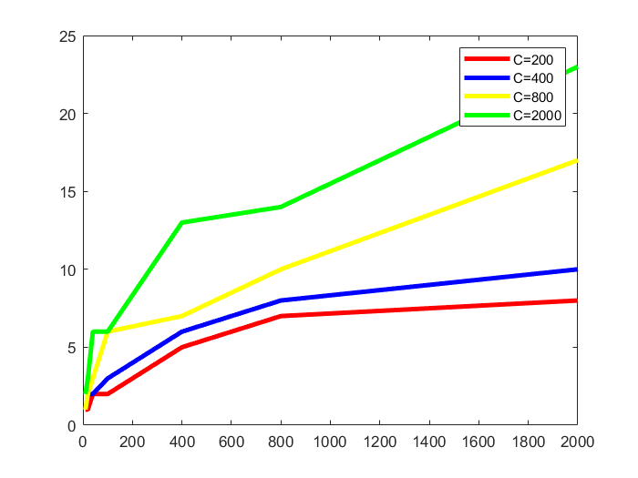

# 实验二、动态规划算法的实现与时间复杂度测试实验报告

## 学号：20204060434

## 实验目的

&nbsp;&nbsp;&nbsp;&nbsp;编程实现经典的动态规划算法，理解动态规划算法设计的基本思想、程序实
现的相关技巧，加深对动态规划算法设计与分析思想的理解。通过程序的执行时间测试结果，与理论上的时间复杂度结论进行对比、分析和验证。

## 实验原理

+ 动态规划算法的基本思想
  
&nbsp;&nbsp;&nbsp;&nbsp;动态规划是一种在数学和计算机科学中使用的、用于求解包含重叠子问题的
最优化问题的有效方法。其基本思想是：将原问题分解为相似的子问题，在求解的过程中通过子问题的解描述并求出原问题的解。动态规划的思想是多种算法的基础，被广泛应用于计算机科学和工程领域，在查找有很多重叠子问题的情况的最优解时有效。它将问题重新组合成子问题，为了避免多次解决这些子问题，它们的结果都逐渐被计算并保存，从小规模的子问题直到整个问题都被解决。因此，
动态规划对每一子问题只做一次计算，具有较高的效率。

+ 测试算法
  
&nbsp;&nbsp;&nbsp;&nbsp;0-1 背包问题是使用动态规划算法求解的代表问题，算法如下：  

&nbsp;&nbsp;KnapsackDP ({w1, w2, …, wn}, {v1, v2, …, vn}, C)

&nbsp;&nbsp;for i=0 to n do

&nbsp;&nbsp;&nbsp;&nbsp;m[i,0]=0

&nbsp;&nbsp;end for

&nbsp;&nbsp;for j=0 to C do

&nbsp;&nbsp;&nbsp;&nbsp;m[0,j]=0

&nbsp;&nbsp;end for

&nbsp;&nbsp;for i=1 to n do

&nbsp;&nbsp;&nbsp;&nbsp;for j=1 to C do

&nbsp;&nbsp;&nbsp;&nbsp;m[i,j]=m[i-1,j]

&nbsp;&nbsp;&nbsp;&nbsp;if wij then

&nbsp;&nbsp;&nbsp;&nbsp;&nbsp;&nbsp;m[i,j]=max{m[i,j],m[i-1,j-wi]+vi}

&nbsp;&nbsp;&nbsp;&nbsp;end if

&nbsp;&nbsp;end for

&nbsp;&nbsp;end for

&nbsp;&nbsp;return m[n,C]

&nbsp;&nbsp;算法的时间复杂度为 O(nC)。

## 实验输入数据集

+ 测试数据集：
  
&nbsp;&nbsp;通过手动设置随机数生成的个数参数n，利用线性同余法实现随机数的生成，生成的随机数用一维数组存储，作为排序的测试用数据。

+ 线性同余法生成随机数：

&nbsp;&nbsp;线性同余法中各参数设置如下：

各物品重量取值随机数生成参数取值：X0 = rand()即随机生成; a = 20; c = 1; m = 1；

各物品价值取值随机数生成参数取值：X0 = rand()即随机生成; a = 50; c = 1; m = 1；


## 实验内容

&nbsp;&nbsp;&nbsp;&nbsp;编程实现以上求解 0-1 背包问题的动态规划算法，并通过手动设置、生成随机数获得实验数据。记录随着输入规模增加算法的执行时间，分析并以图形方式展现增长率；测试、验证、对比算法的时间复杂度。

## 实验预期结果与实际结果

+ 实验预期结果：

实验过程及实验结果（Java版）

```bash
gitpod /workspace/homework_template (main) $ javac KnapsackDP.java 
Picked up JAVA_TOOL_OPTIONS:  -Xmx3435m
gitpod /workspace/homework_template (main) $ java KnapsackDP 
Picked up JAVA_TOOL_OPTIONS:  -Xmx3435m
2405
当前程序耗时：10ms
```
当前测试结果为背包容量为2000，物品种类为100前提下的测试结果。

+ （1）、测试 C 值不变的情形下随着 n 增加、程序执行时间增加的趋势。对于C=200、400、800、2000 这四种情形，分别使用 1.1 节中的随机数生成算法生成 n 个随机数作为 n 个物品的重量，再生成 n 个随机数作为 n 个物品的价值（n=10,
20, 40, 100, 200, 400, 800, 2000）。对于每个 C 值，记录随着 n 增加程序的执行时间，并使用 MS Excel、Matlab 或 Origin 等图表绘制工具生成各不同 C 值情形下程序执行时间的对比曲线图。



&nbsp;&nbsp;0-1背包问题，若采用动态规划算法进行求解，可以获得最终的正确答案，其时间复杂度与背包容量C的大小有关，即该问题的时间复杂度为O(nC),该时间复杂度是一个伪多项式时间复杂度，即取决于背包容量的大小，物品种类的数量以及所对应的计量单位。

&nbsp;&nbsp;因此通过该图可以知道，当物品种类数量达到一定规模时在不同背包容量下对应的时间复杂度存在一定的差异。其中，随着背包容量的增大时间复杂度依次升高。但是在物品种类数量少于一定规模时，其时间复杂度差异不大。

&nbsp;&nbsp;程序执行所需的时间复杂度不仅与算法本身的设计、问题规模有关，还与执行程序的硬件设备有关。实际运行结果所获得的时间复杂度与理论结果的时间复杂度的增长率相近。