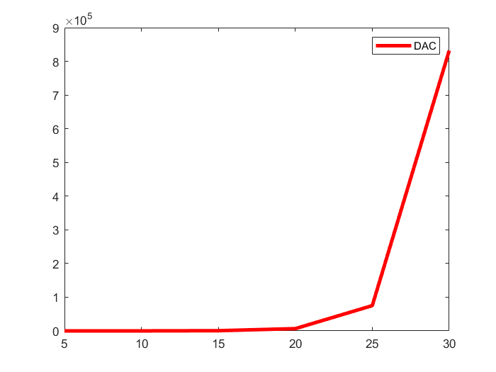
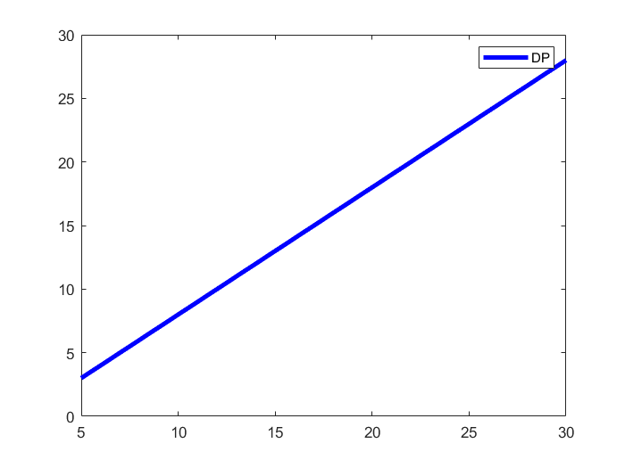
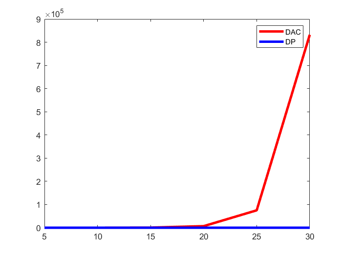

# 实验二动态规划算法的适应性测试报告

## 学号：20201060434

## 实验目的

&nbsp;&nbsp;&nbsp;&nbsp;对于同一问题，编程实现其分治算法和动态规划算法，通过对比分析，理解动态规划算法的适用情形。通过程序的执行时间测试结果，与理论结论进行对比、分析和验证。

## 实验原理

+ 分治算法与动态规划算法的对比：针对子问题是否重叠
  
&nbsp;&nbsp;&nbsp;&nbsp;虽然很多问题均可分解为子问题、动态规划和分治算法都是通过子问题的解决来获得原问题的解。然而，分治算法适用于子问题不重叠（即相互独立）的情形，对于子问题重叠的情形分治法具有较高的时间复杂度，动态规划是针对这类情形的有效算法。

+ 测试算法
  
&nbsp;&nbsp;&nbsp;&nbsp;斐波纳契数列在现代物理、准晶体结构、化学等领域都有直接的应用。斐波那契数列指的是这样一个数列：1、1、2、3、5、8、13、21、……，这个数列从第三项开始，每一项都等于前两项之和，即：

&nbsp;&nbsp;&nbsp;&nbsp;直观地，斐波那契数列可递归得到，算法如下：

&nbsp;&nbsp;DAC_f(n)

&nbsp;&nbsp;if(n==1) or (n==2) then

&nbsp;&nbsp;&nbsp;&nbsp;return 1

&nbsp;&nbsp;else

&nbsp;&nbsp;&nbsp;&nbsp;return f(n-1)+f(n-2)

&nbsp;&nbsp;end if

&nbsp;&nbsp;&nbsp;&nbsp;通过理论分析已经得出结论：以上递归算法随着 n 增大有指数计算时间。对
于 n 的多项式个数的子问题，显然指数计算时间是不现实的。基于动态规划算法可高效地求解 Fibonacci 数问题，算法如下：

&nbsp;&nbsp;DP_f(n)

&nbsp;&nbsp;Initialize f[1..n]

&nbsp;&nbsp;for i=1 to n do

&nbsp;&nbsp;&nbsp;&nbsp;if(i==1) or (i==2) then

&nbsp;&nbsp;&nbsp;&nbsp;&nbsp;&nbsp;f[i]=1

&nbsp;&nbsp;&nbsp;&nbsp;else

&nbsp;&nbsp;&nbsp;&nbsp;&nbsp;&nbsp;f[i]=f[i-1]+f[i-2]

&nbsp;&nbsp;&nbsp;&nbsp;end if

&nbsp;&nbsp;end for

&nbsp;&nbsp;return f[n]

&nbsp;&nbsp;算法的时间复杂度为 O(n)。

## 实验输入数据集

+ 测试数据集：
  
&nbsp;&nbsp;通过键盘输入待求斐波那契数列的规模n，在该实验中n分别取为：n=5, 10, 15, 20, 25, 30。

## 实验内容

&nbsp;&nbsp;&nbsp;&nbsp;编程实现以上求斐波纳契数的分治算法和动态规划算法。对于每个算法，记录随着斐波纳契数数列大小增加基本操作的执行次数，分析并以图形方式展现增长率；对比这两个算法，随着数列大小增加算法增长率的变化趋势；测试、验证、对比理论结论。

## 实验预期结果与实际结果

+ 实验预期结果：

实验过程及实验结果（C版）

```bash
gitpod /workspace/homework_template (main) $ gcc DAC_F.c -o dac_f
gitpod /workspace/homework_template (main) $ ./dac_f
6764

gitpod /workspace/homework_template (main) $ gcc DP_F.c -o dp_f
gitpod /workspace/homework_template (main) $ ./dp_f
28
```
上述程序测试结果分别为：

利用分治算法求解斐波那契数列，且此时n = 20;

利用动态规划算法求解斐波那契数列，且此时n = 30。


+ （1）、分别测试不同 n 值（n=5, 10, 15, 20, 25, 30）情形下 DAC_f 和 DP_f 算法的加法次数，记录加法次数，并使用 MS Excel、Matlab 或 Origin 等图表绘制工具生成各不同 n 值情形下以上两个算法加法次数的对比曲线图。

&nbsp;&nbsp;在不同问题规模下分别采用分治算法和动态规划算法来实现斐波那契数列的求解。
| | n = 5 | n = 10 | n = 15 | n = 20 | n = 25 | n = 30 |
| :---: | :---: | :---: | :---: | :---: | :---: | :---: |
| DAC_f | 4 | 54 | 609 | 6764 | 75024 | 832039 |
| DP_f | 3 | 8 | 13 | 18 | 23 | 28 |







&nbsp;&nbsp;（1）、通过完成本次实验，我们可以知道通过分治法实现斐波那契数列比通过动态规范法实现斐波那契数列的时间复杂度高，因为该问题存在子问题的重复计算问题，导致基本操作次数的执行次数增多使得算法的时间复杂度提高。

&nbsp;&nbsp;（2）、分治法与动态规划法的相同点：将带求解问题不断划分，当问题划分到一定规模后将可以直接进行求解，最终将所求解子问题进行合并，从而实现问题的求解。

&nbsp;&nbsp;（3）、分治法与动态规划法的异同点：若待求解问题的子问题具有重叠部分，则对于子问题不独立，更多采用动态规划法进行求解，此时可以将所求解的子问题进行保存，避免子问题的重复求解降低时间复杂度；若子问题重叠部分较少则分治算法和动态规划算法均可以选取。在时间复杂度方面不会存在过大的差异。

